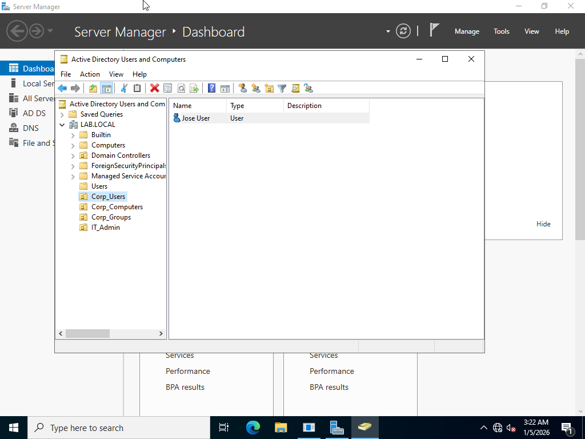

# Lab 01 – Active Directory Domain Setup

## 🎯 Objective
Deploy a Windows Server domain controller and configure Active Directory in a virtual lab environment.

## 🛠️ Tools Used
- Windows Server
- Virtual Machine (VMware / VirtualBox)
- Active Directory Domain Services (AD DS)
- Windows Client VM

## 🧪 Lab Steps & Evidence

### ✅ Step 1 – Default AD Containers

Verified default Organizational Units and containers after domain creation.

---

### ✅ Step 2 – Organizational Unit Structure

Created custom Organizational Units to organize users and resources.

---

### ✅ Step 3 – Domain User Provisioning

Created and validated domain users inside Active Directory.

---

## ✅ Skills Demonstrated
- Active Directory deployment
- Domain configuration
- Identity infrastructure fundamentals
- Windows Server administration
- Troubleshooting and validation
