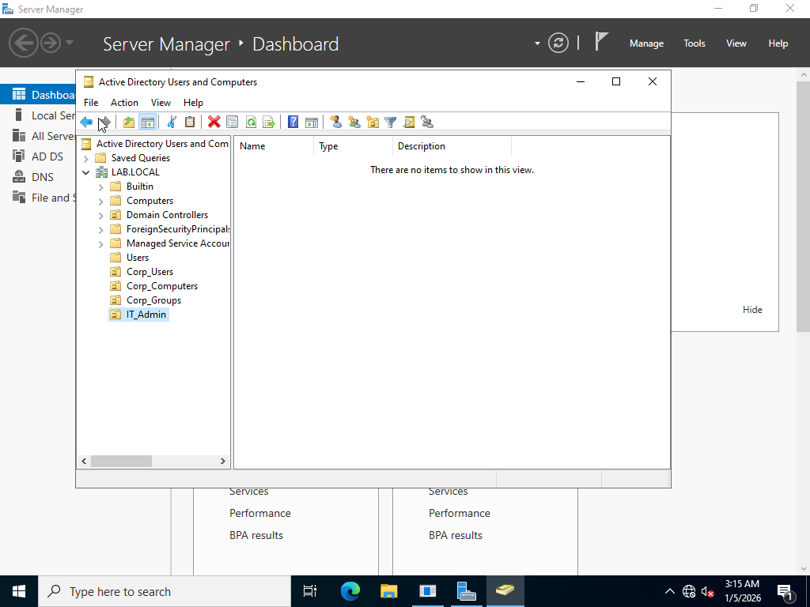

# Lab 01 – Active Directory Domain Setup

## 🎯 Objective
Build a Windows Server domain controller, configure Active Directory Domain Services (AD DS), and validate organizational structure, users, and administration readiness.

---

## 🧰 Tools & Environment
- Windows Server (Domain Controller)
- Active Directory Domain Services (AD DS)
- Active Directory Users and Computers (ADUC)
- VMware / VirtualBox
- Windows Client VM

---

## ✅ Lab Steps & Evidence

---

### 🔹 Step 1 – Default AD Containers (ADUC View)
Validated default Organizational Units and containers after domain creation.

Validated containers:
- Builtin
- Computers
- Domain Controllers
- Users
- ForeignSecurityPrincipals
- Managed Service Accounts

---

### 🔹 Step 2 – Default AD Containers Expanded
Expanded the default container tree to confirm structure and navigation.

Verified visibility of all core containers and domain hierarchy.

---

### 🔹 Step 3 – Custom Organizational Unit Structure
Created custom Organizational Units to logically separate users, computers, groups, and administrative objects.

Created OUs:
- Corp_Users
- Corp_Computers
- Corp_Groups
- IT_Admin

---

### 🔹 Step 4 – Domain User Creation
Created and validated a domain user account inside the appropriate Organizational Unit.

Confirmed user object creation and proper OU placement.

---

## 🧪 Validation Performed
- Verified Active Directory container structure
- Confirmed Organizational Unit hierarchy
- Validated domain object creation
- Confirmed administrative visibility and navigation in ADUC

---

## 📚 What I Learned
- How Active Directory organizes objects using containers and Organizational Units
- How to design OU structures for scalability and security
- How to create and manage domain users in ADUC
- How to validate domain configuration visually and logically
- How enterprise directory structures mirror real-world IT environments

---

## ✅ Outcome
Successfully deployed a functional Active Directory domain, validated default containers, created a structured OU hierarchy, and provisioned a domain user for administrative readiness.

---
