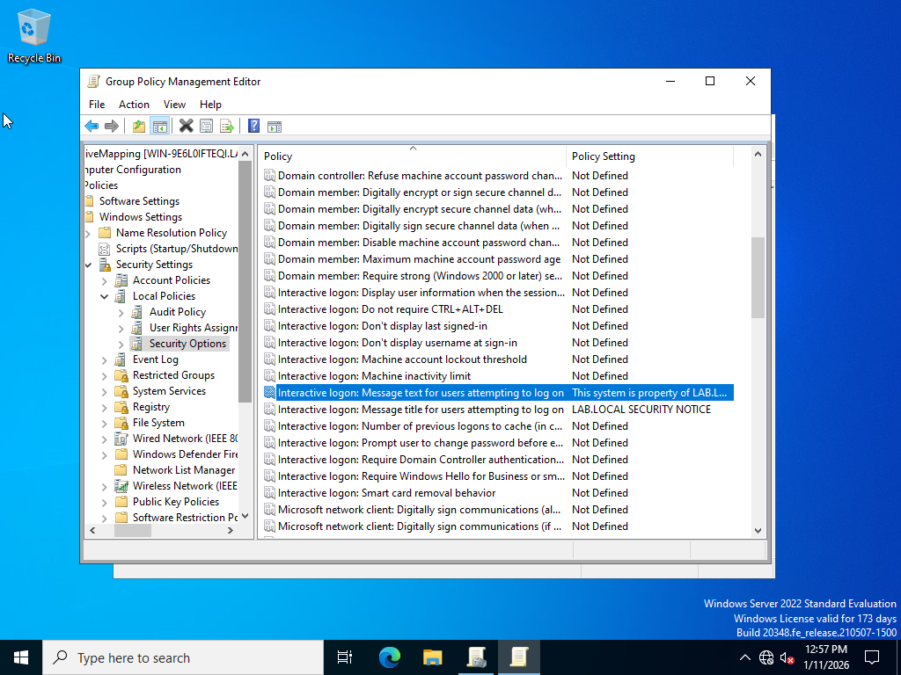

# Lab 02 – Group Policy Configuration

## 🎯 Objective
Create and apply Group Policy Objects (GPOs) to enforce security and configuration policies in a Windows domain.

## 🛠️ Tools Used
- Windows Server
- Group Policy Management Console (GPMC)
- Active Directory
- Windows Client VM

## 🧪 Lab Steps & Evidence

### ✅ Step 1 – Create GPO

Created a new Group Policy Object and linked it to the appropriate Organizational Unit.

---

### ✅ Step 2 – Drive Mapping Configuration

Configured automatic drive mapping using Group Policy Preferences.

---

### ✅ Step 3 – Security Banner Policy

Applied a legal notice and security banner policy for user login compliance.

---

### ✅ Step 4 – Shared Folder Permissions

Validated access permissions to shared folders controlled through Group Policy.

---

## ✅ Skills Demonstrated
- Group Policy configuration
- Security policy enforcement
- Access control validation
- Windows domain administration
- Troubleshooting and verification
