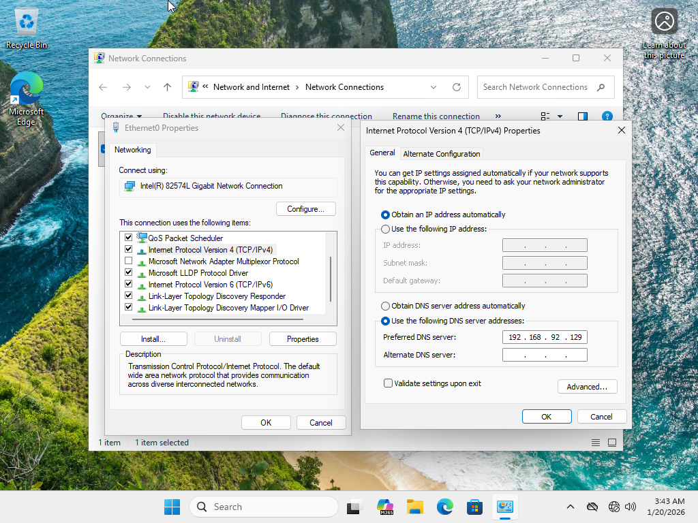
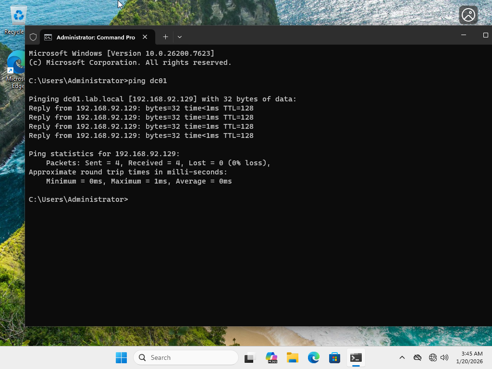
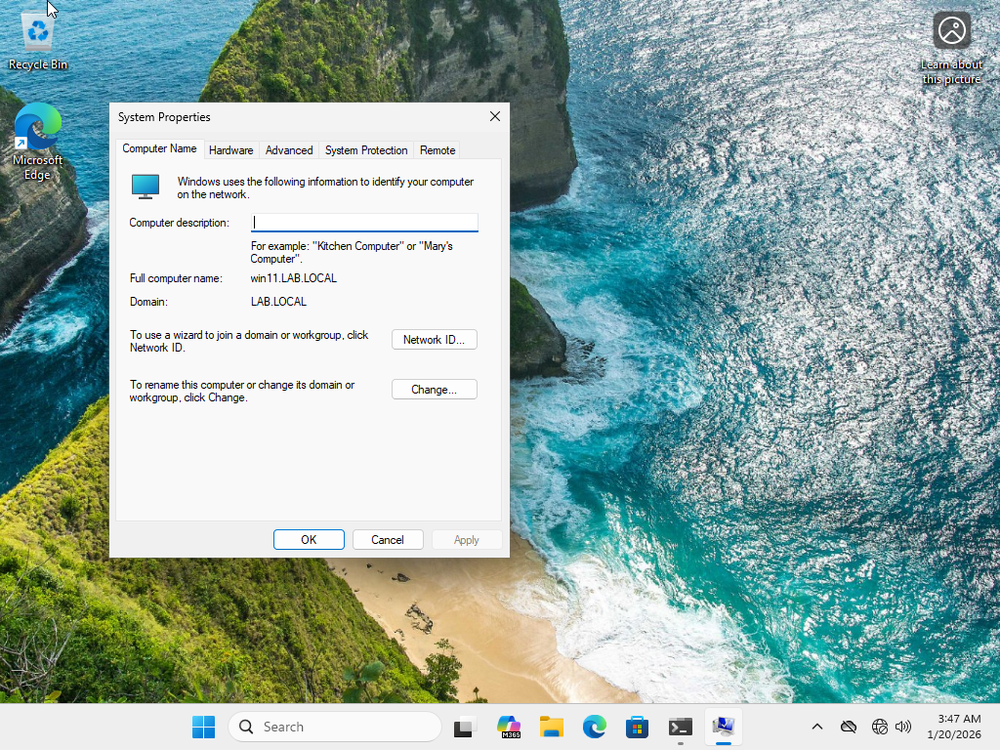

# Lab 03 – Windows Client Join & Network Troubleshooting

## 🎯 Objective
Demonstrate the ability to troubleshoot virtual network connectivity, configure DNS correctly, and successfully join a Windows client to an Active Directory domain.

## 🧩 Environment
- VMware Workstation
- Windows Server (Domain Controller)
- Windows 11 Client
- Host-Only Virtual Network (VMnet1)

## 🔧 Tasks Performed
- Validated virtual network configuration across multiple VMs
- Identified subnet mismatch between domain controller and client
- Corrected virtual network configuration using Host-Only networking
- Configured client DNS to point to the domain controller
- Verified connectivity using ping and name resolution
- Joined Windows client to Active Directory domain
- Validated domain authentication

## 📸 Evidence

### DC01 IP Configuration


---

### Windows Client IP Configuration


---

### DNS Configuration on Client


---

### Connectivity Validation (Ping DC01)


---

### Domain Join Confirmation


---

### Domain Login Validation


---

## ✅ Validation Commands

```bash
ipconfig
ping DC01
nslookup lab.local
whoami

---

## 🧠 What I Learned

- How virtual networking works in VMware (NAT vs Host-Only)
- How to troubleshoot connectivity issues using tools such as ping, ipconfig, and nslookup
- How DNS configuration impacts Active Directory domain joins
- How to manually configure a Windows client to point to a domain controller
- How to validate successful domain joins and domain authentication
- How to document technical work clearly using screenshots and GitHub
- Improved confidence troubleshooting real-world network issues

This lab strengthened my understanding of Windows networking fundamentals and domain infrastructure.
