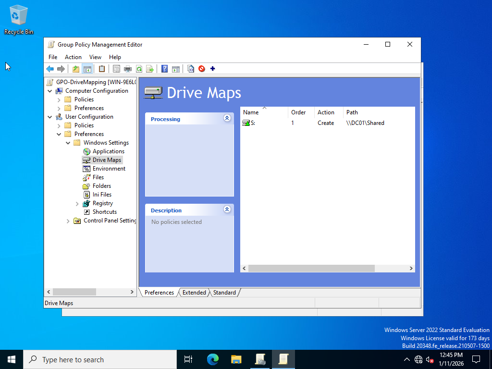

# IT-Labs
IT Home Labs – Active Directory, Group Policy, Desktop Support
# IT Home Labs Portfolio

## Lab 1: Active Directory & Desktop Support Home Lab

### Overview
Built a Windows Server Active Directory environment to support enterprise-style user and device management. This lab focused on directory services, DNS integration, organizational unit (OU) design, and secure user provisioning.

### Environment
- Hypervisor: VMware Workstation Pro  
- Server OS: Windows Server 2022  
- Domain: LAB.LOCAL  
- Services: Active Directory Domain Services (AD DS), DNS  
- Networking: Static IP configuration  

### What Was Configured
- Installed and configured Active Directory Domain Services  
- Promoted a Windows Server to a Domain Controller  
- Configured DNS for internal name resolution  
- Designed Organizational Unit (OU) structure  
- Created and managed domain users  
- Enforced Active Directory password complexity policies  

### Evidence
#### Active Directory Domain Context

Verified successful domain creation and administrative access by managing objects directly within the LAB.LOCAL domain.

#### Default Active Directory Containers

Validated successful domain controller promotion by confirming the presence of default Active Directory containers within the LAB.LOCAL domain.

#### Organizational Unit (OU) Structure

Created custom organizational units to logically separate users, computers, groups, and IT administration in accordance with Active Directory best practices.

#### Domain User Provisioning

Provisioned domain user accounts within a dedicated organizational unit while enforcing Active Directory password complexity policies.

### Skills Demonstrated
- Active Directory Administration  
- Identity & Access Management (IAM)  
- Windows Server Administration  
- DNS & Networking Fundamentals  
- Desktop Support Fundamentals  

### What I Learned
This lab reinforced the relationship between Active Directory and DNS, the importance of proper OU structure for scalable administration, and how password policies enforce security during user provisioning.

---

## Lab 2: Group Policy Administration

### Overview
Implemented centralized endpoint management using Group Policy Objects (GPOs) to automate drive mapping and enforce a security login banner across the domain environment.

### Objective
- Create a shared network resource
- Apply drive mapping via Group Policy
- Enforce a security login banner
- Demonstrate centralized policy management

### Configuration Summary
- Created a shared folder on the domain controller with group-based permissions  
- Created and linked a custom Group Policy Object (GPO)  
- Configured drive mapping using Group Policy Preferences  
- Applied item-level targeting using security groups  
- Implemented a security login banner using security policies  

### Evidence

#### Shared Folder Permissions

Configured NTFS and share permissions to allow access only for authorized security group members.

#### Group Policy Object Created

Created and linked a custom GPO to centrally manage user configuration settings.

#### Drive Mapping Configuration

Configured automatic network drive mapping using Group Policy Preferences with item-level security targeting.

#### Security Login Banner Policy

Enforced a legal security login banner using Group Policy security options.

### Skills Demonstrated
- Group Policy Management  
- Windows Server Administration  
- Access Control & Permissions  
- Identity and Access Management (IAM)  
- Endpoint Configuration Management  

### What I Learned
This lab demonstrated how Group Policy enables centralized management of user environments, improves security consistency, and reduces manual administrative effort in enterprise environments.

