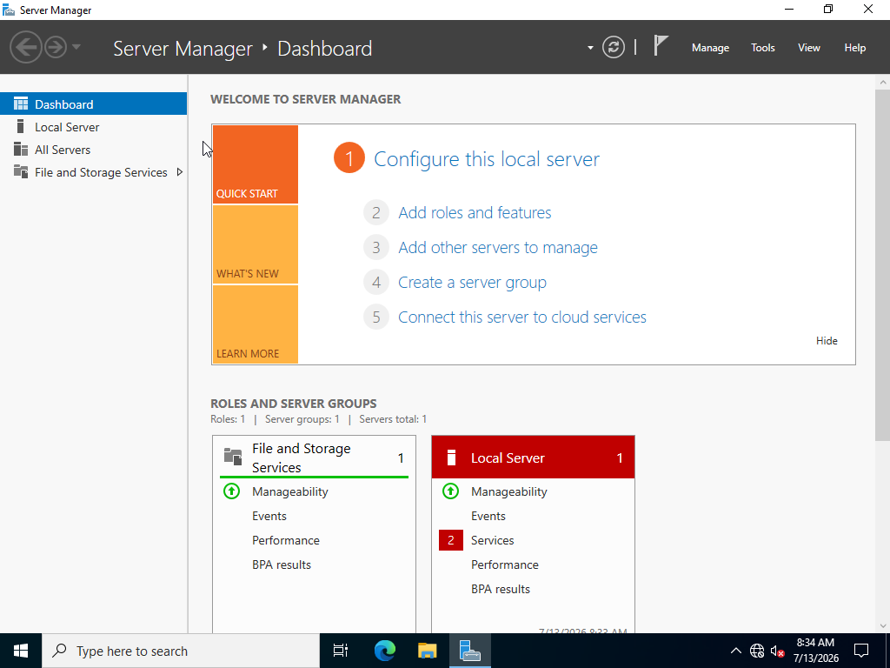
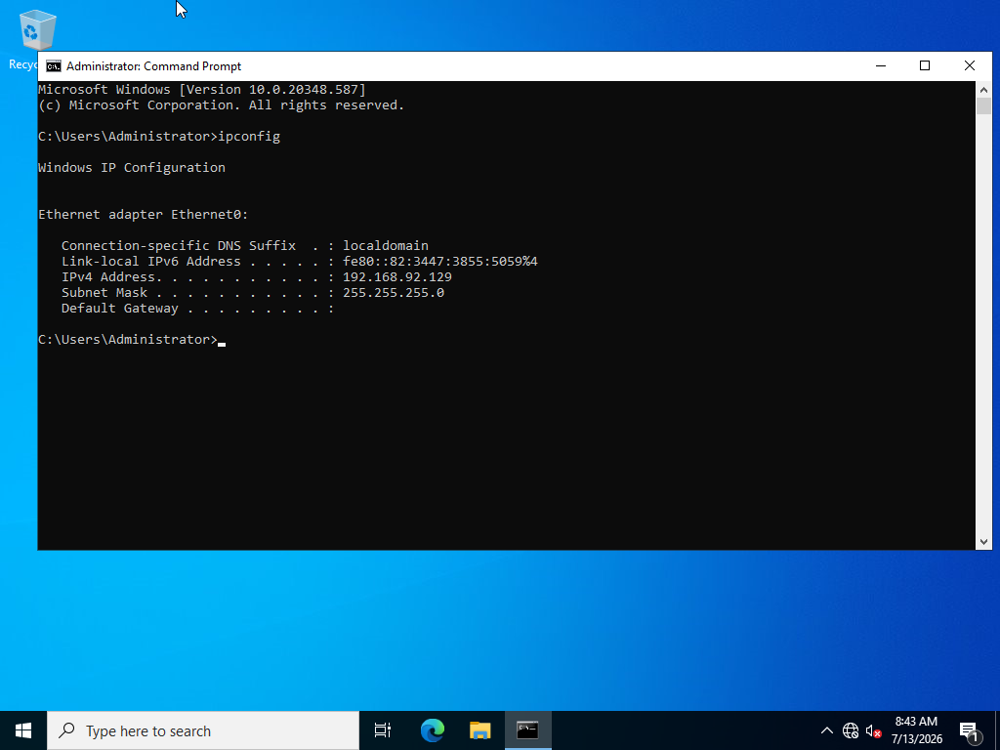
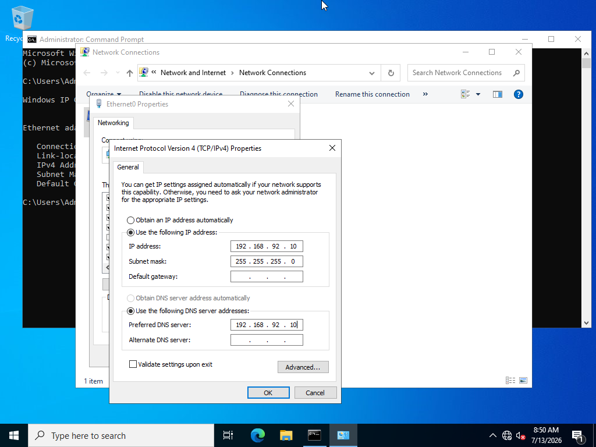
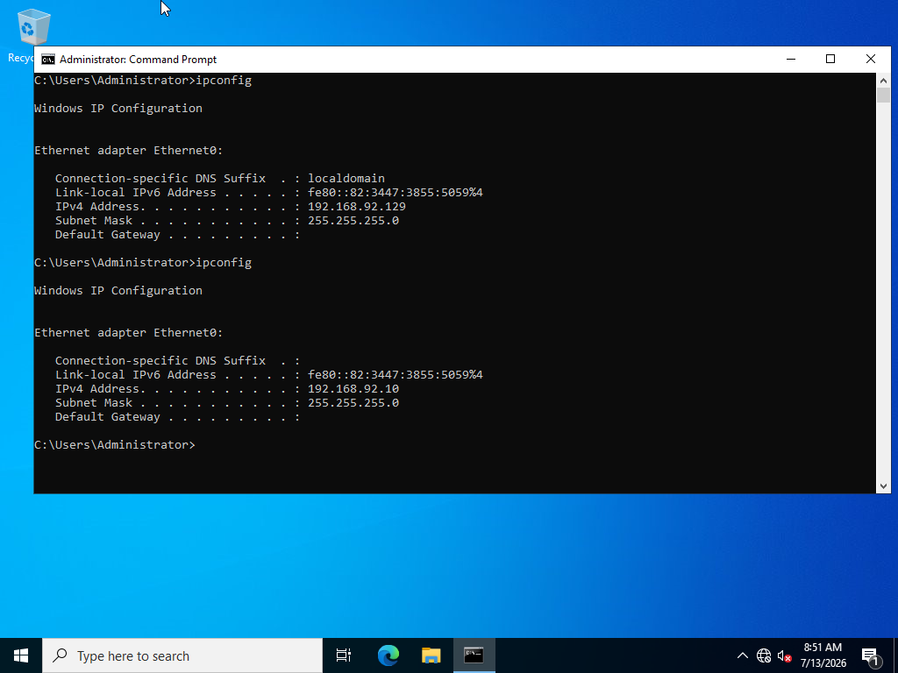
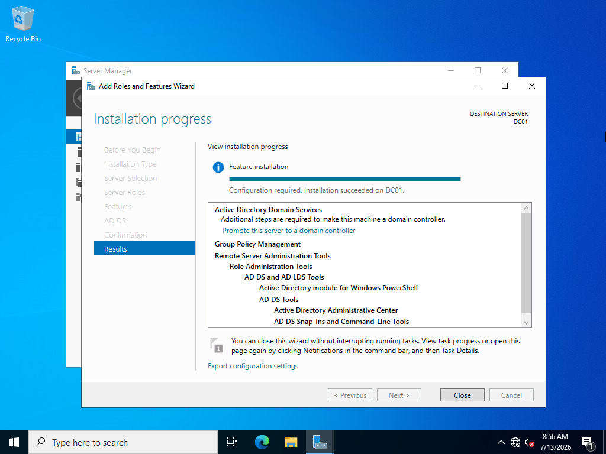
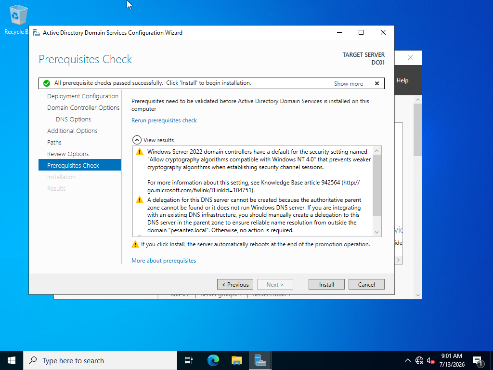
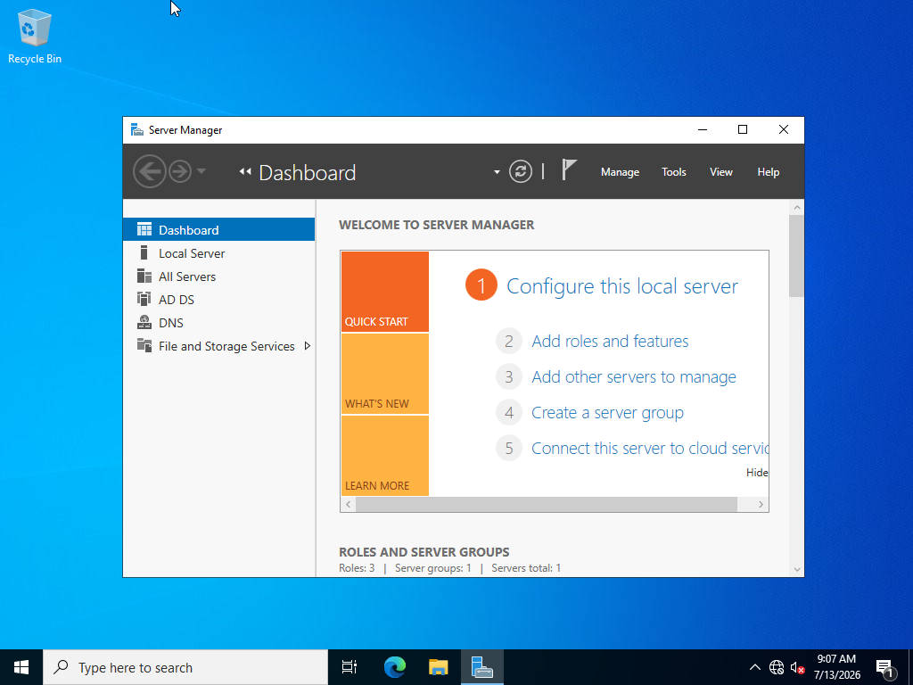
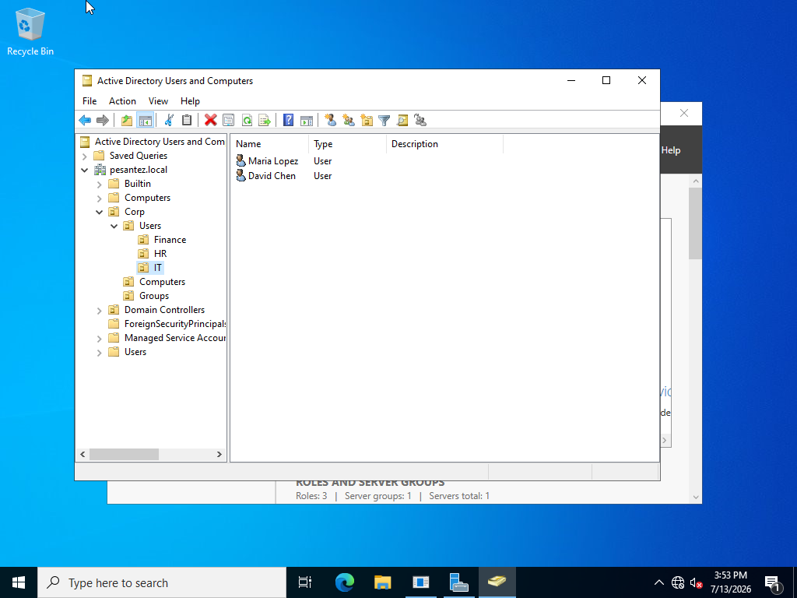
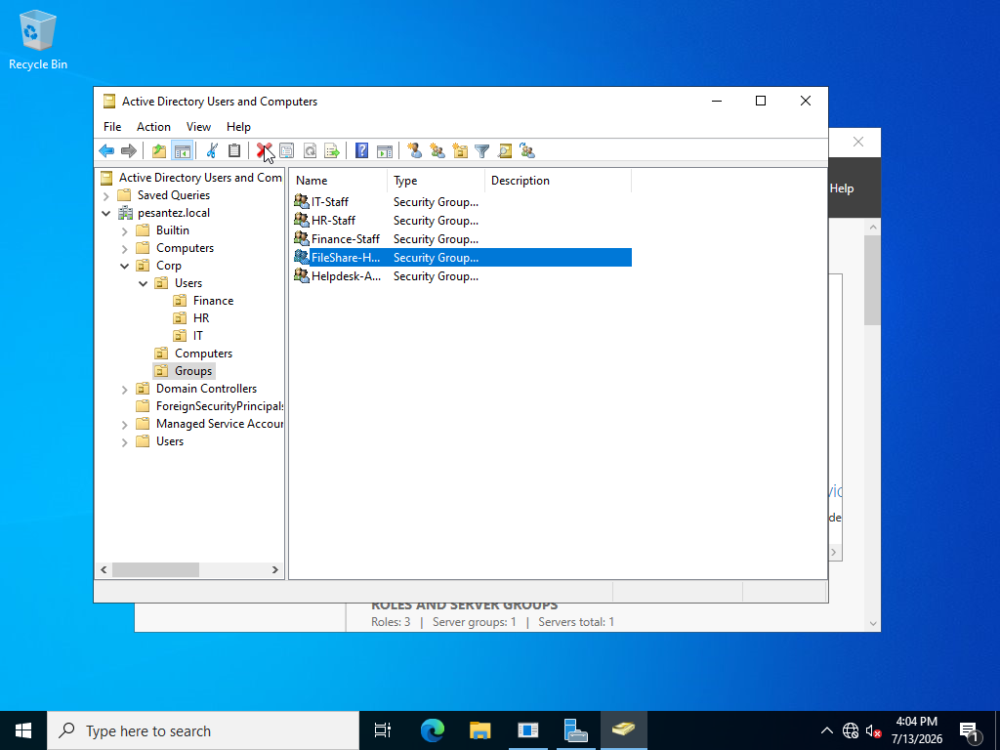
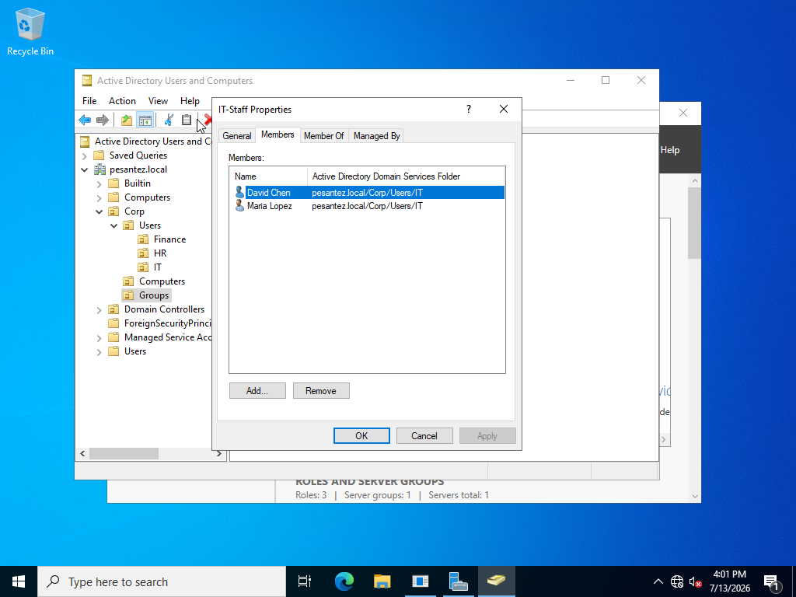

# Lab 1: Active Directory Domain Setup

> Deploying a Windows Server 2022 domain controller from scratch — the identity backbone that every on-prem and hybrid IAM environment is built on.

**Status:** ✅ Complete

---

## 🎯 Objectives
- Deploy Windows Server 2022 on VMware Workstation and configure it as DC01 with a static IP
- Install Active Directory Domain Services (AD DS) and DNS
- Promote the server to a domain controller for a new forest (**pesantez.local**)
- Design an OU structure modeling a small business (departments, users, computers, groups)
- Create role-based security groups and provision test users

## 🏗️ Environment
| Component | Details |
|---|---|
| Platform | VMware Workstation |
| Machine | DC01 — Windows Server 2022 Standard Evaluation (Desktop Experience), 8 GB RAM, 2 vCPU, 80 GB disk |
| Network | Host-only lab network — static IP 192.168.92.10 /24, no gateway (isolated by design) |
| Tools | Server Manager, Active Directory Users and Computers (ADUC), Command Prompt |

## 🔧 Steps

### 1. Install Windows Server 2022
Created the VM manually (removed VMware's Easy Install answer file to control the installation) and installed **Windows Server 2022 Standard Evaluation (Desktop Experience)** — deliberately choosing the GUI edition over Server Core.



### 2. Set the server's identity: hostname and static IP
Renamed the machine to **DC01**, then replaced the DHCP-assigned address (192.168.92.129) with a static configuration: IP **192.168.92.10**, mask 255.255.255.0, no default gateway (host-only network), and **DNS pointed at itself** — because after promotion, this server becomes the domain's DNS. A domain controller must have a static address: every client locates the domain by querying this server's DNS.





### 3. Install AD DS and promote to domain controller
Installed the Active Directory Domain Services role via Server Manager, then promoted DC01 to a domain controller, creating a **new forest: pesantez.local** with integrated DNS. Set the DSRM recovery password and completed the promotion (automatic reboot). After reboot, login switched to the domain context: PESANTEZ\Administrator.





### 4. Build the OU structure
Created a custom OU hierarchy instead of using the built-in Users/Computers containers (built-in containers cannot have Group Policy linked to them):

```
pesantez.local
└── Corp
    ├── Users
    │   ├── IT
    │   ├── HR
    │   └── Finance
    ├── Computers
    └── Groups
```

This structure exists to serve the two purposes of OUs: delegated administration and clean Group Policy targeting (used in Lab 3).


### 5. Provision users
Created six test users across the department OUs, each with **"User must change password at next logon"** enabled — matching real-world onboarding practice where IT issues a temporary password that the employee replaces at first sign-in.

| OU | User | Logon |
|---|---|---|
| IT | Maria Lopez | mlopez |
| IT | David Chen | dchen |
| HR | Sarah Johnson | sjohnson |
| HR | Luis Rivera | lrivera |
| Finance | Emily Park | epark |
| Finance | James Wright | jwright |



### 6. Create role-based security groups
Created six Global Security groups in Corp/Groups, assigning permissions to roles — never to individual users:

| Group | Purpose | Members |
|---|---|---|
| IT-Staff | Department role group | mlopez, dchen |
| HR-Staff | Department role group | sjohnson, lrivera |
| Finance-Staff | Department role group | epark, jwright |
| Helpdesk-Admins | Elevated IT role | mlopez |
| FileShare-HR-RW | Resource group (pre-staged for Lab 4) | — |
| FileShare-Finance-RW | Resource group (pre-staged for Lab 4) | — |

The empty FileShare groups are deliberate: the RBAC pattern is *users → role groups → resource groups*, and the resource groups get wired to NTFS permissions in Lab 4.




## ✅ Verification
- Post-promotion login succeeds as **PESANTEZ\Administrator** (domain context, not local)
- Server Manager shows **AD DS** and **DNS** roles active
- `ipconfig` confirms static 192.168.92.10 with DNS pointed at itself
- All users appear in their correct OUs; group memberships verified via the Members tab

## 🧠 What broke / What I learned
- **Problem:** VMware attached an "Easy Install" answer-file floppy to the new VM, which would have auto-selected the installation edition. → **Diagnosis:** spotted the floppy device pointing at an autoinst file in the VM settings before first boot. → **Fix:** removed the floppy device and performed the installation manually, selecting Desktop Experience deliberately.
- **Problem:** The evaluation ISO turned out to be Windows Server **2022**, not the version assumed from the download date. → **Diagnosis:** checked the OS build number (20348 = Server 2022) after install. → **Fix:** verified 2022 covers every lab objective identically and documented the actual version. Lesson: verify what's actually installed — never assume from a filename.
- **Problem:** A security group was created with a transposed name ("Filesahre-HR…"). → **Diagnosis:** caught during a final review of the Groups OU against the design table. → **Fix:** renamed the group (including the pre-Windows 2000 name) before any permissions referenced it. Lesson: in IAM, naming discipline *is* access discipline — a typo'd group is a future misconfigured permission.
- **Takeaway:** DNS is the domain's nervous system — the DC points DNS at itself, and every client must point DNS at the DC. Most domain problems trace back to this.

## 🔗 Skills demonstrated
AD DS · DNS · Domain promotion · OU design · User provisioning · RBAC group design · Windows Server administration

---
*Part of the [IT-Labs portfolio](../../README.md) · Jose Pesantez*
