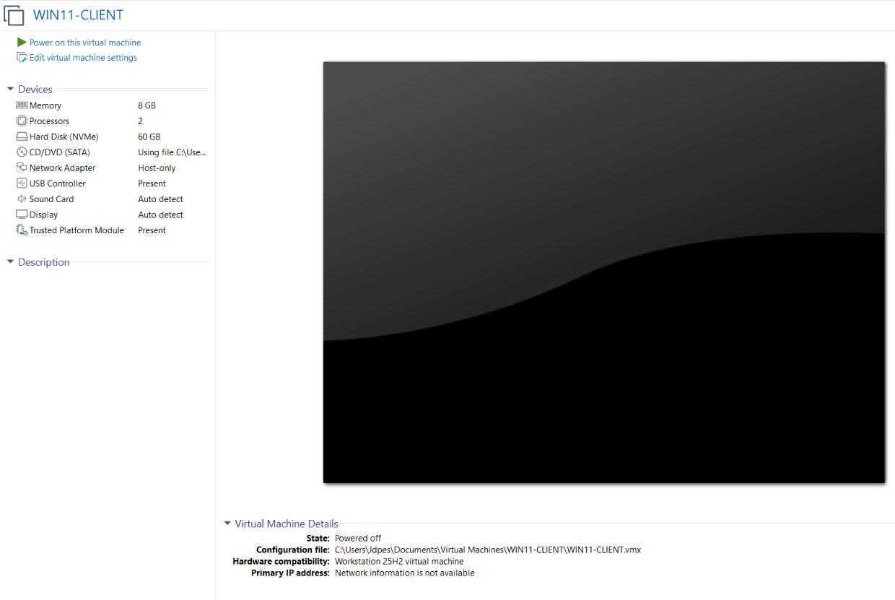
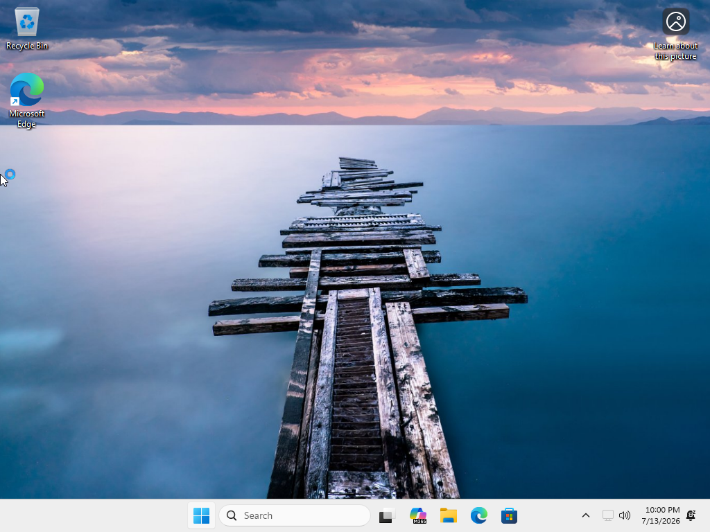
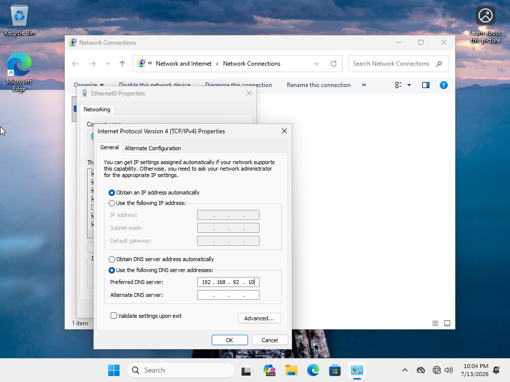
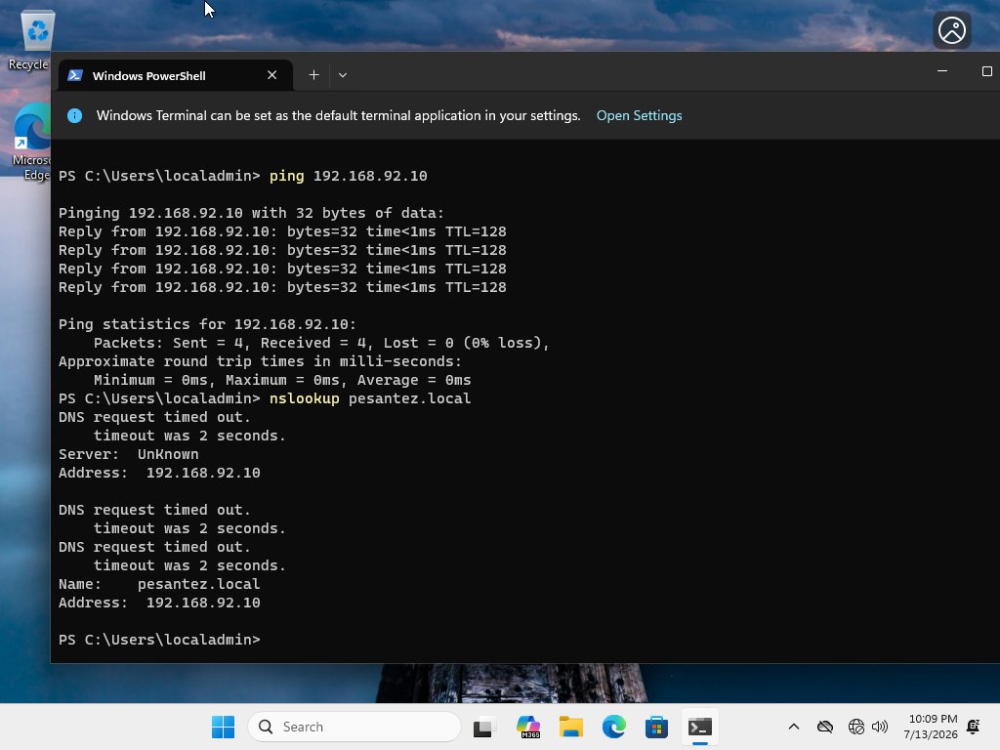
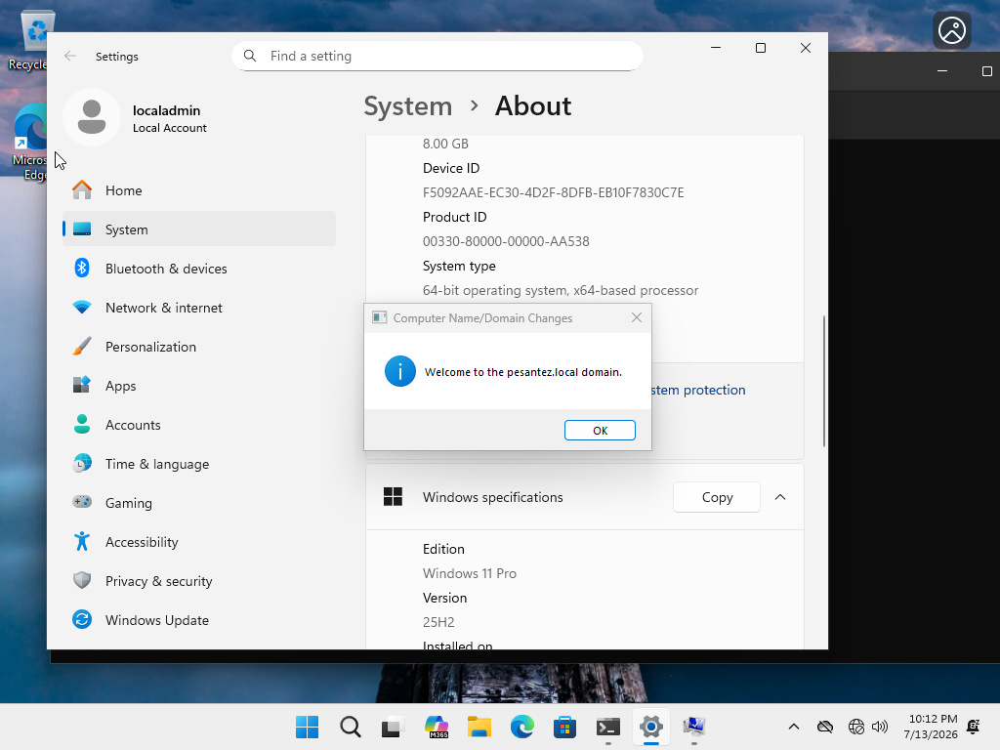
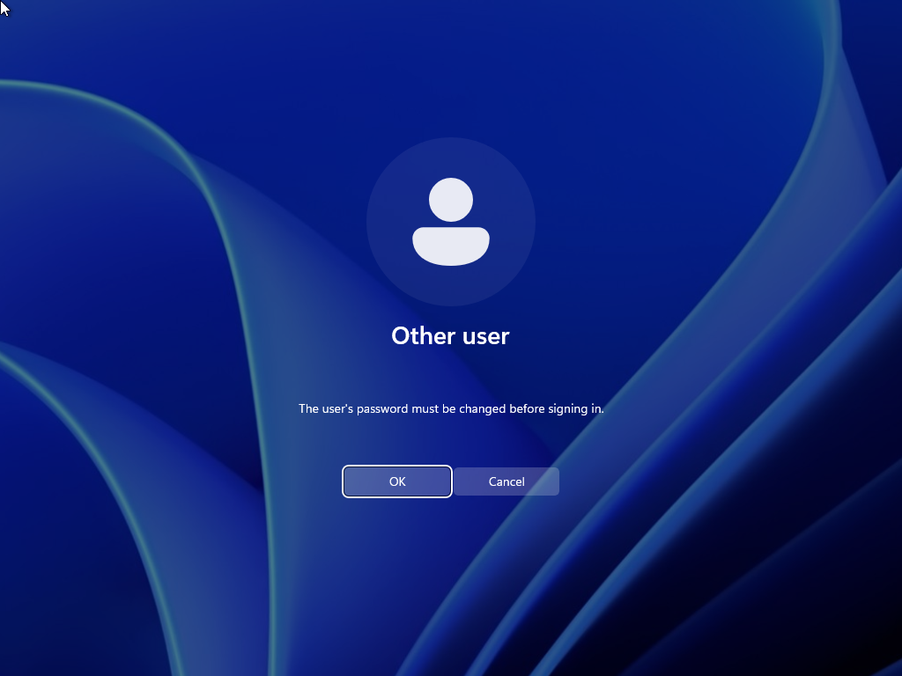
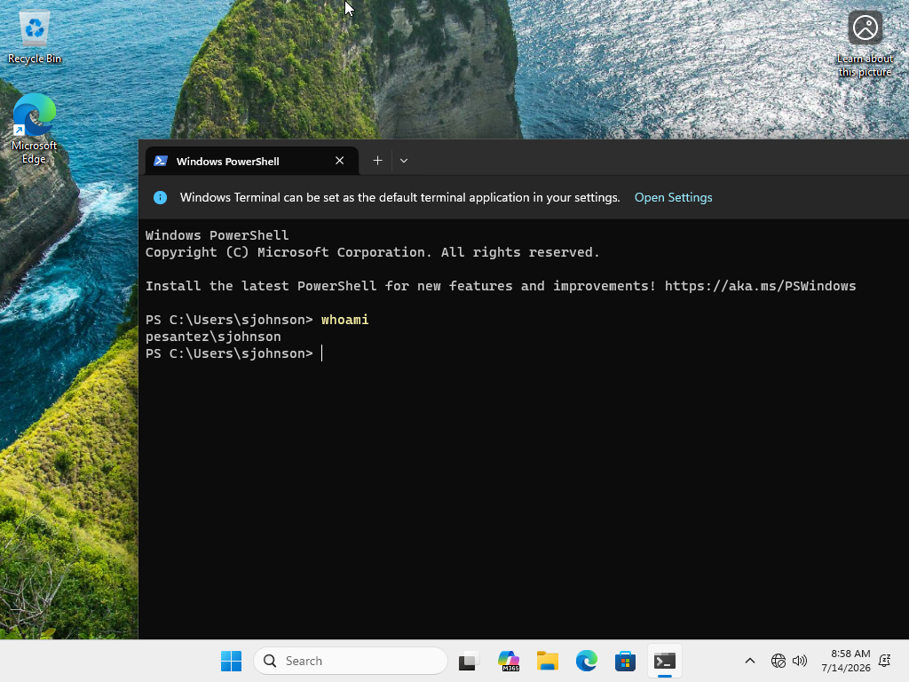
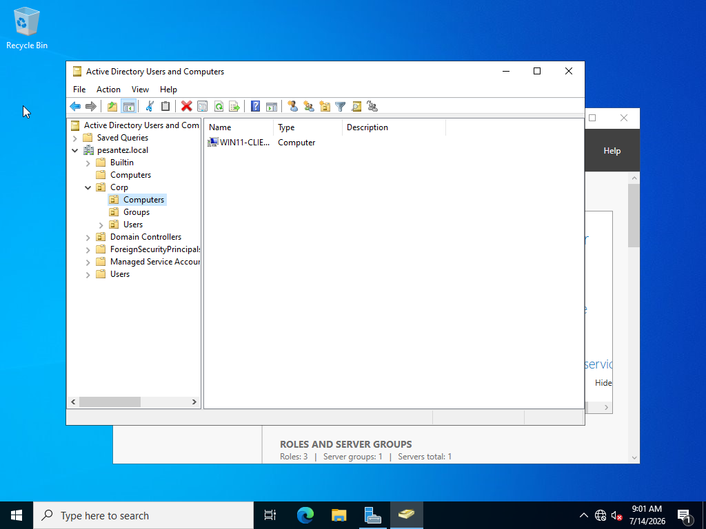

# Lab 2: Windows 11 Domain Client

> Joining a Windows 11 endpoint to the domain and onboarding its first user — the day-one workflow for every employee machine in an enterprise.

**Status:** ✅ Complete

---

## 🎯 Objectives
- Deploy a Windows 11 Pro client VM (WIN11-CLIENT) with a local administrator account
- Point the client's DNS at the domain controller and verify name resolution
- Join the client to the **pesantez.local** domain
- Complete a realistic first-login onboarding for a domain user (forced password change)
- Verify the computer object in Active Directory and move it into the correct OU

## 🏗️ Environment
| Component | Details |
|---|---|
| Platform | VMware Workstation |
| Client | WIN11-CLIENT — Windows 11 Pro, 8 GB RAM, 2 vCPU, 60 GB disk, virtual TPM |
| Server | DC01 — Windows Server 2022 domain controller (192.168.92.10), from Lab 1 |
| Network | Host-only lab network — client on DHCP, DNS pointed at DC01 |
| Tools | Windows Settings, PowerShell, ADUC |

## 🔧 Steps

### 1. Create the client VM
Built the VM manually with Windows 11's requirements in mind — including the virtual Trusted Platform Module (TPM) that Windows 11 requires. Selected **Windows 11 Pro** during installation: the Home edition cannot join a domain.

### 2. Install Windows 11 with a local account (offline)
The lab network is host-only (no internet), and Windows 11 setup demands a network connection and Microsoft account. Bypassed this at the "Let's connect you to a network" screen with **Shift+F10** → `start ms-cxh:localonly`, creating a local administrator (**localadmin**) instead. The local account is the machine's caretaker — domain users don't exist on the machine until it joins the domain.

### 3. Rename the PC and point DNS at the domain controller
Renamed the machine to **WIN11-CLIENT**, left the IP on DHCP (only servers need static addresses), and set the preferred DNS server to **192.168.92.10** — DC01. This is the single most important setting for a domain join: clients locate the domain by querying DNS, and only the DC's DNS knows pesantez.local exists.

### 4. Verify connectivity before joining
Confirmed the path to the domain before attempting the join:
- `ping 192.168.92.10` → 4/4 replies
- `nslookup pesantez.local` → resolved to 192.168.92.10

The nslookup output also showed "DNS request timed out / Server: UnKnown" lines — these are reverse-lookup noise (no reverse lookup zone exists in the lab), not a failure. The forward lookup that matters succeeded.

### 5. Join the domain
System Properties → Change → Member of **Domain: pesantez.local**, authorized with domain administrator credentials. Received the "Welcome to the pesantez.local domain" confirmation and rebooted.

### 6. First domain login — realistic user onboarding
Logged in at "Other user" as **PESANTEZ\sjohnson** (Sarah Johnson, HR — provisioned in Lab 1 with "User must change password at next logon"). Windows enforced the password change before sign-in — exactly how real IT onboarding hands a temporary password to a new hire. After the change, Windows built her profile and confirmed identity with `whoami` → `pesantez\sjohnson`.

### 7. Verify and organize the computer object
On DC01, confirmed WIN11-CLIENT self-registered in the built-in Computers container during the join, then moved it into **Corp → Computers** — the custom OU where Group Policy will target it in Lab 3. Computers are identities in AD just like users: the join created a computer account with its own machine credential.

## ✅ Verification
- "Welcome to the pesantez.local domain" confirmation on join
- Domain user login succeeds with enforced first-login password change
- `whoami` returns `pesantez\sjohnson`
- WIN11-CLIENT computer object present in ADUC and placed in Corp/Computers

## 🧠 What broke / What I learned
- **Problem:** Windows 11 setup refused to proceed without internet and a Microsoft account — impossible on an isolated host-only network. → **Diagnosis:** this is OOBE policy, not a network fault; the lab design is intentionally offline. → **Fix:** `Shift+F10` → `start ms-cxh:localonly` to create a local account offline. Lesson: enterprise imaging pipelines exist precisely because consumer setup flows don't fit managed environments.
- **Problem:** `nslookup` returned "DNS request timed out / Server: UnKnown" despite working name resolution. → **Diagnosis:** the errors were reverse-lookup attempts (resolving the DNS server's own name); no reverse lookup zone exists in the lab. The forward lookup succeeded. → **Fix:** none needed — recognizing which errors are noise is the skill. Chasing cosmetic errors wastes real troubleshooting time.
- **Takeaway:** the entire domain join lives or dies on one setting — the client's DNS server. "Domain could not be contacted" almost always means DNS is pointed somewhere other than the DC.

## 🔗 Skills demonstrated
Domain join · DNS configuration & troubleshooting · Windows 11 deployment · User onboarding · Computer object management · Local vs. domain identity

---
*Part of the [IT-Labs portfolio](../../README.md) · Jose Pesantez*
