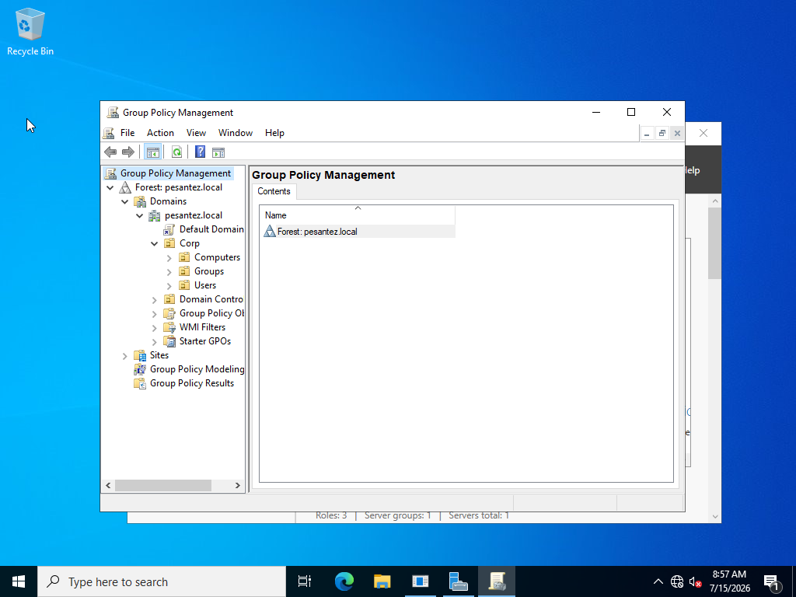
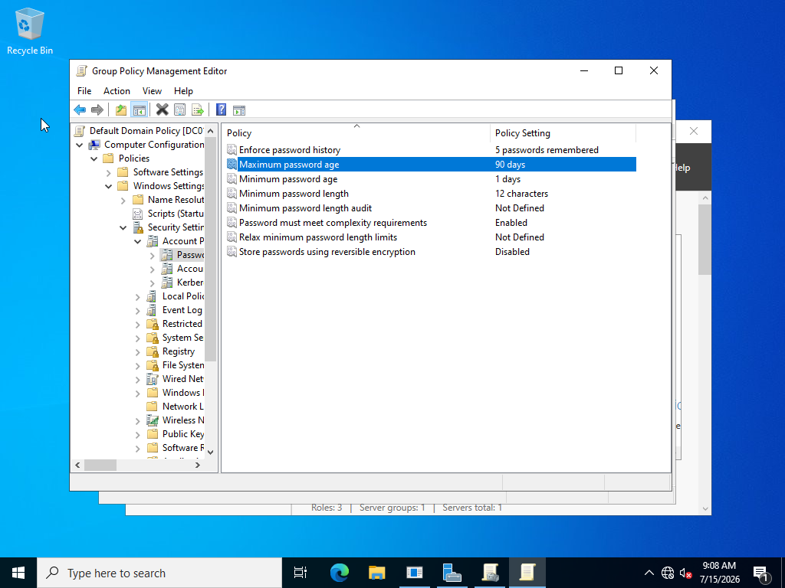
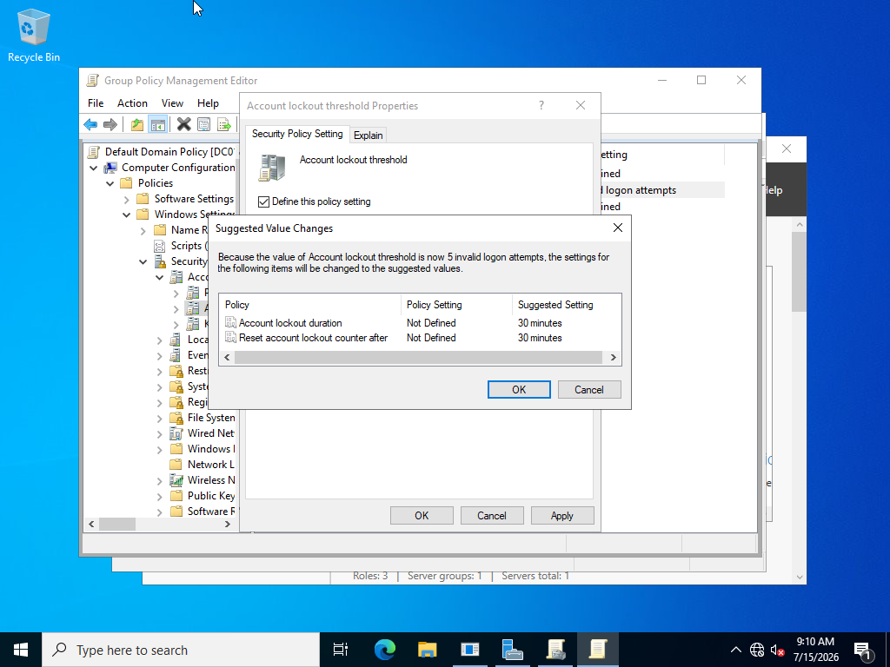
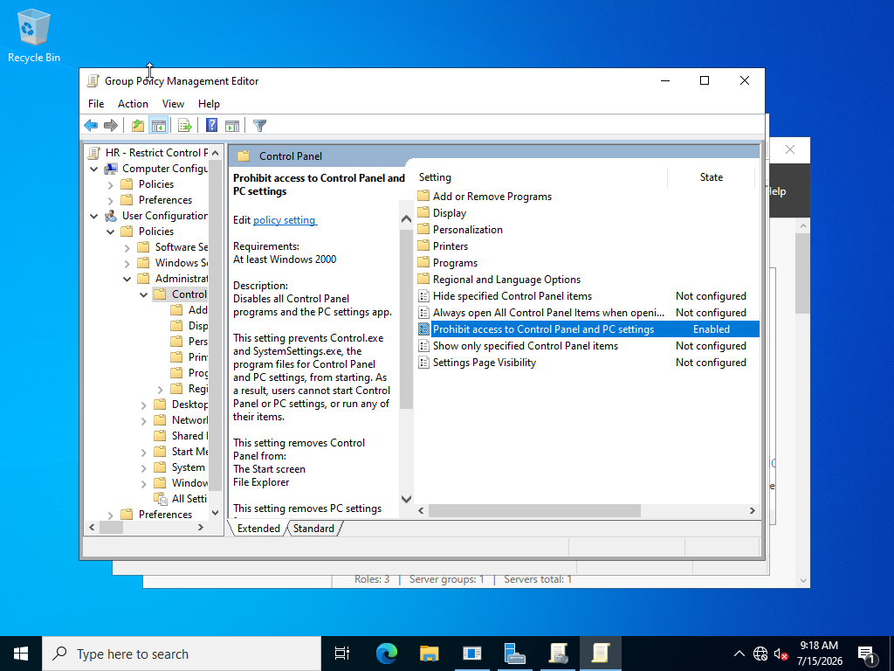
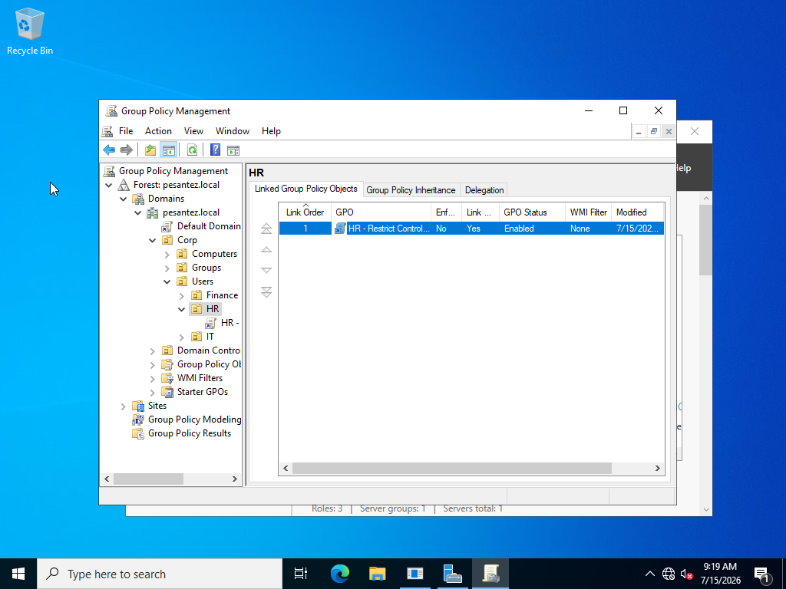
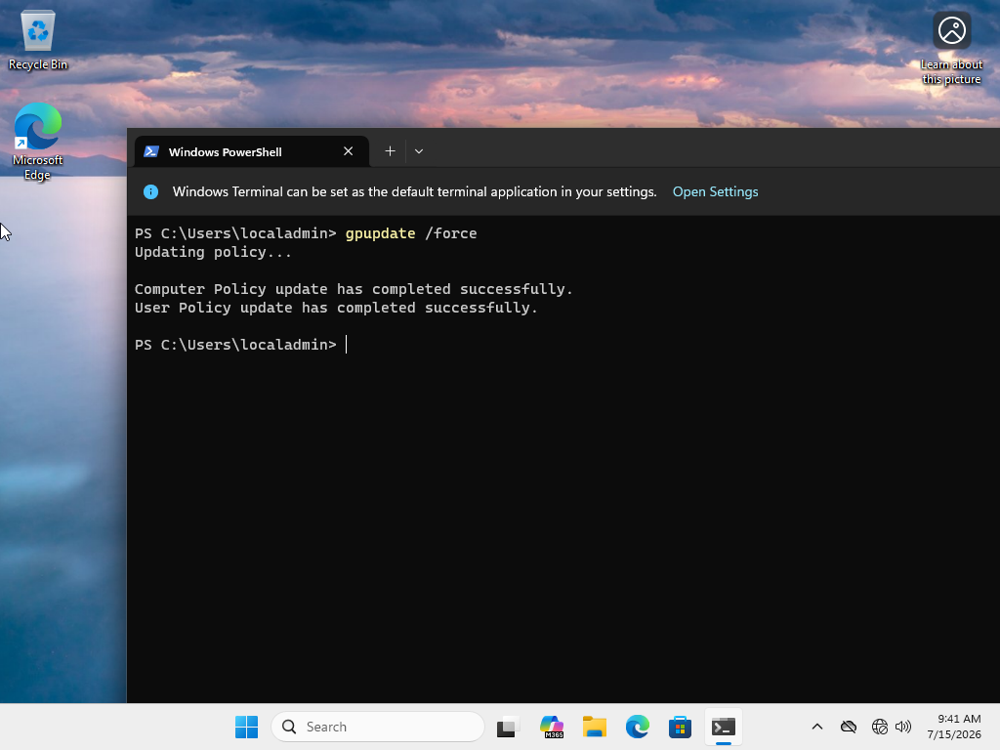
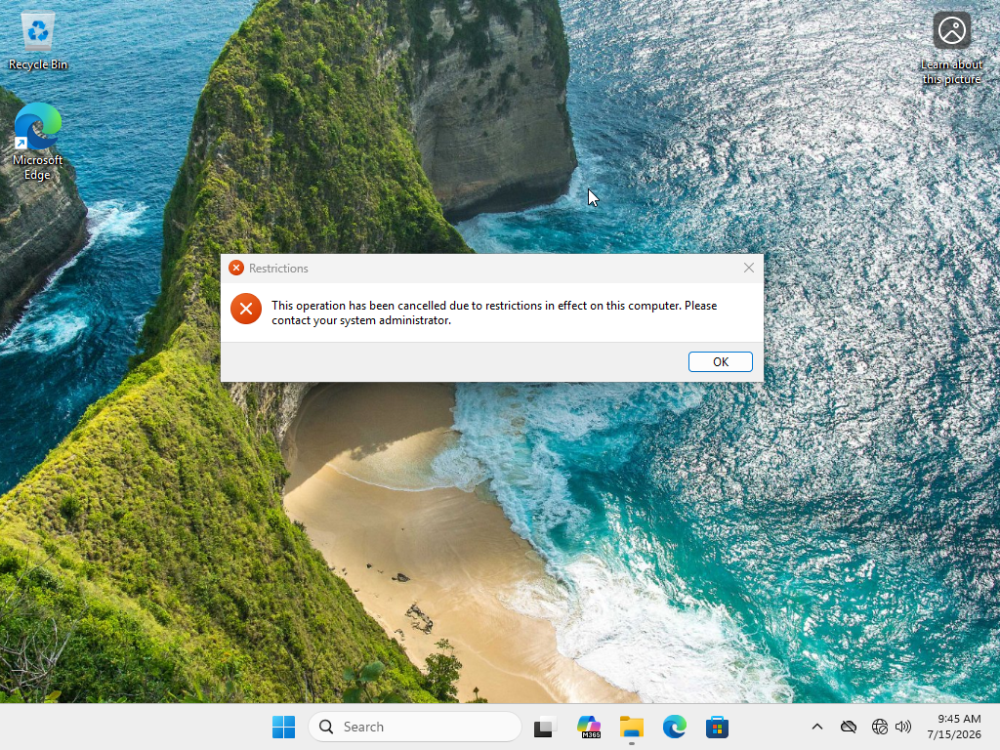
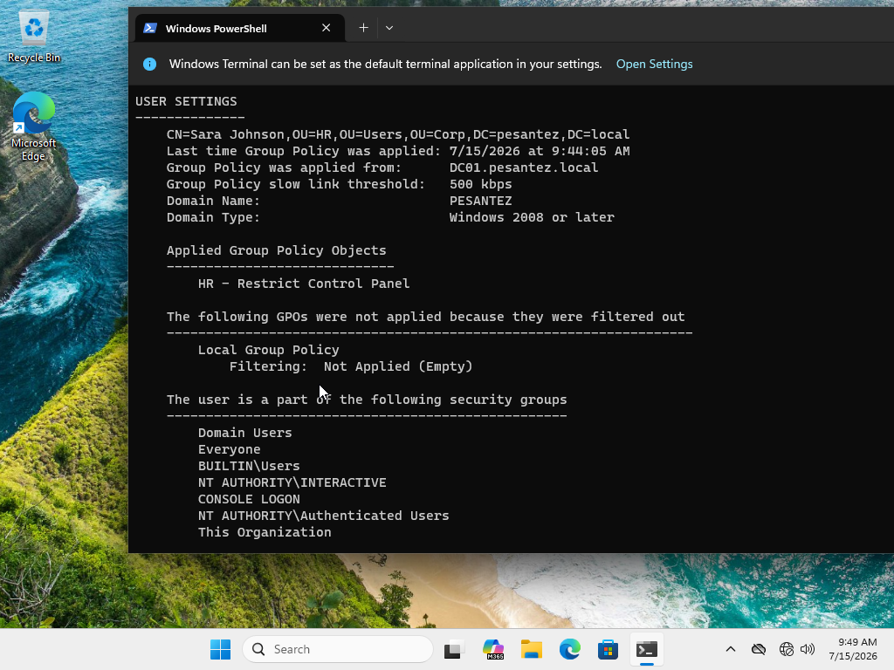
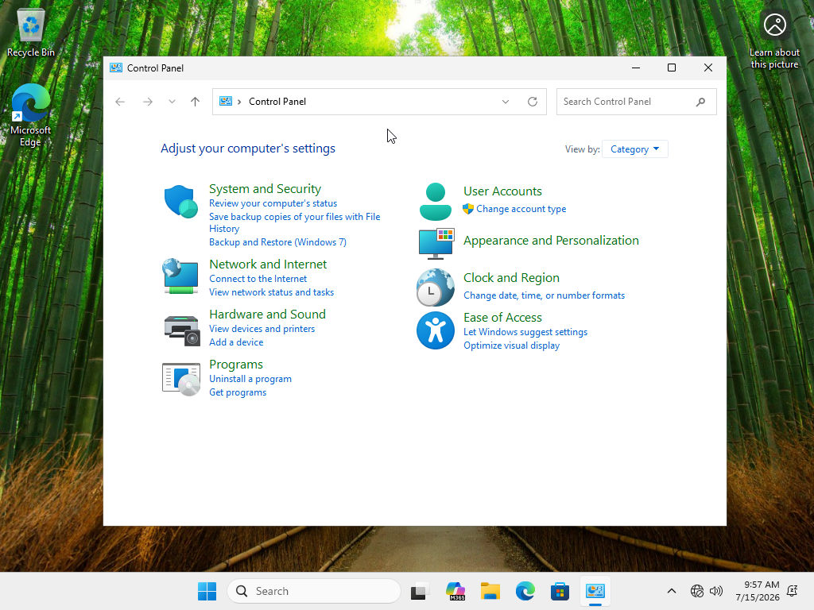

# Lab 3: Group Policy Management

> Enforcing security baselines and user restrictions from the domain controller — one console controlling every machine and user, without ever touching an endpoint.

**Status:** ✅ Complete

---

## 🎯 Objectives
- Configure a domain-wide password and account lockout policy (security baseline)
- Create a targeted GPO from scratch and link it to a specific OU
- Understand GPO scope: Computer vs. User Configuration, linking, inheritance, and precedence
- Force policy application and verify results on a domain client
- Prove OU targeting with a control test (affected user vs. unaffected user on the same machine)

## 🏗️ Environment
| Component | Details |
|---|---|
| Platform | VMware Workstation |
| Server | DC01 — Windows Server 2022 (192.168.92.10), Group Policy Management Console |
| Client | WIN11-CLIENT — Windows 11 Pro, domain-joined (Lab 2) |
| Test users | sjohnson (Corp/Users/HR) · mlopez (Corp/Users/IT) |
| Tools | GPMC, Group Policy Management Editor, `gpupdate`, `gpresult` |

## 🔧 Steps

### 1. Survey the Group Policy landscape
Opened Group Policy Management on DC01: the domain (pesantez.local), the Default Domain Policy, and the Corp OU structure from Lab 1 — the targeting system every GPO link depends on.

### 2. Configure the domain password policy
Edited the **Default Domain Policy** (Microsoft's intended home for password settings) under *Computer Configuration → Windows Settings → Security Settings → Account Policies*:

| Setting | Value |
|---|---|
| Minimum password length | 12 characters |
| Enforce password history | 5 passwords |
| Maximum password age | 90 days |
| Complexity requirements | Enabled |

Key concept: password policy lives in **Computer Configuration** (machines enforce password checks) and only functions when linked at the **domain level** — a common interview trick question.

### 3. Configure account lockout
Set the lockout threshold to **5 invalid attempts** (30-minute lockout/reset window) — basic brute-force protection.

### 4. Create a targeted GPO: "HR - Restrict Control Panel"
Created a new GPO linked directly to **Corp/Users/HR** and enabled *User Configuration → Administrative Templates → Control Panel → "Prohibit access to Control Panel and PC settings."*

This is a **User Configuration** setting linked to a **users OU** — deliberately matching the setting's audience to the container's contents. A user-side setting linked to a computers OU applies to nothing, silently.

### 5. Force policy refresh on the client
On WIN11-CLIENT, ran `gpupdate /force` to pull the new policies immediately (clients otherwise refresh on a ~90-minute cycle).

### 6. Test as an HR user — policy enforced
Logged in as **sjohnson** (HR OU) and attempted to open Control Panel. Result:

> "This operation has been cancelled due to restrictions in effect on this computer."

Confirmed with `gpresult /r`: **HR - Restrict Control Panel** listed under Applied Group Policy Objects for her session.

### 7. Control test as an IT user — policy correctly NOT applied
Logged in as **mlopez** (IT OU) on the *same machine*. Control Panel opened normally — the GPO is linked to the HR OU only, so IT users are untouched. Same computer, two users, opposite outcomes: OU targeting proven.

Bonus verification during Maria's first login: her initial password change was **rejected until it met the new 12-character domain policy** — live proof that the domain-level password baseline from Step 2 was already enforcing.

## ✅ Verification
- Control Panel blocked for HR user, available for IT user, on the same client
- `gpresult /r` shows the HR GPO applied only to the HR user's session
- New 12-character password policy actively enforced during a real password change
- `gpupdate /force` completed for both Computer and User policy

## 🧠 What broke / What I learned
- **Problem:** After the domain join, logging in as "localadmin" failed — the login screen showed "Sign in to: PESANTEZ" and searched the domain for a nonexistent account. → **Diagnosis:** domain-joined machines default to the domain sign-in context; local accounts still exist but need explicit addressing. → **Fix:** signed in as `WIN11-CLIENT\localadmin` (or `.\localadmin`). Lesson: local vs. domain identity isn't just theory — the machine makes you prove you know the difference.
- **Observation:** the Control Panel ban produced no error anywhere on the server side — a GPO that's linked to the wrong container simply applies to nothing, silently. `gpresult /r` is the ground truth for what actually applied to whom.
- **Takeaway:** GPO work is 90% scope — which chapter (Computer vs. User Configuration), which container it's linked to, and how inheritance stacks. The settings themselves are the easy part.

## 🔗 Skills demonstrated
Group Policy design · Security baselines (password & lockout policy) · OU-targeted GPOs · gpupdate/gpresult verification · Policy troubleshooting · Local vs. domain authentication

---
*Part of the [IT-Labs portfolio](../../README.md) · Jose Pesantez*
