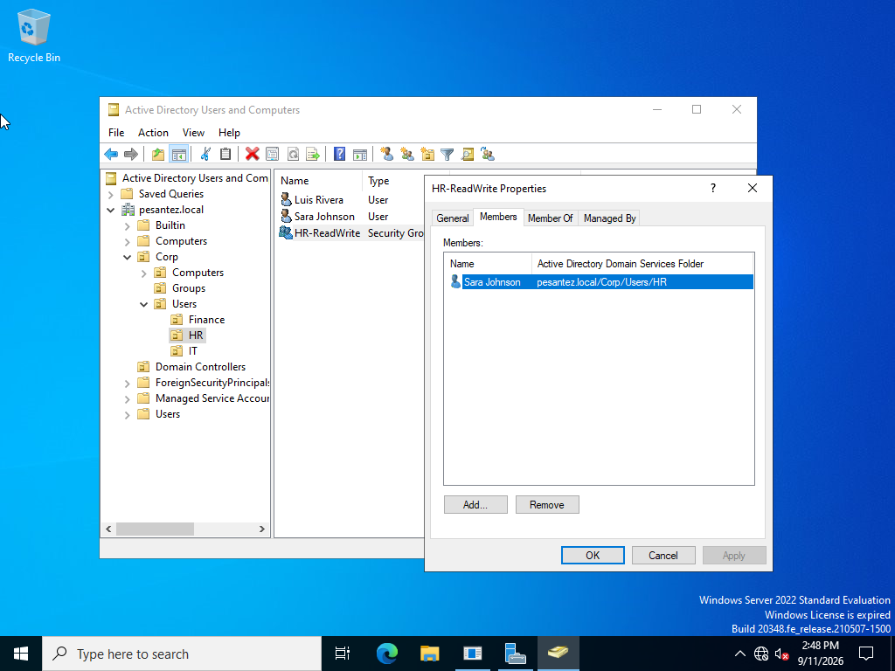
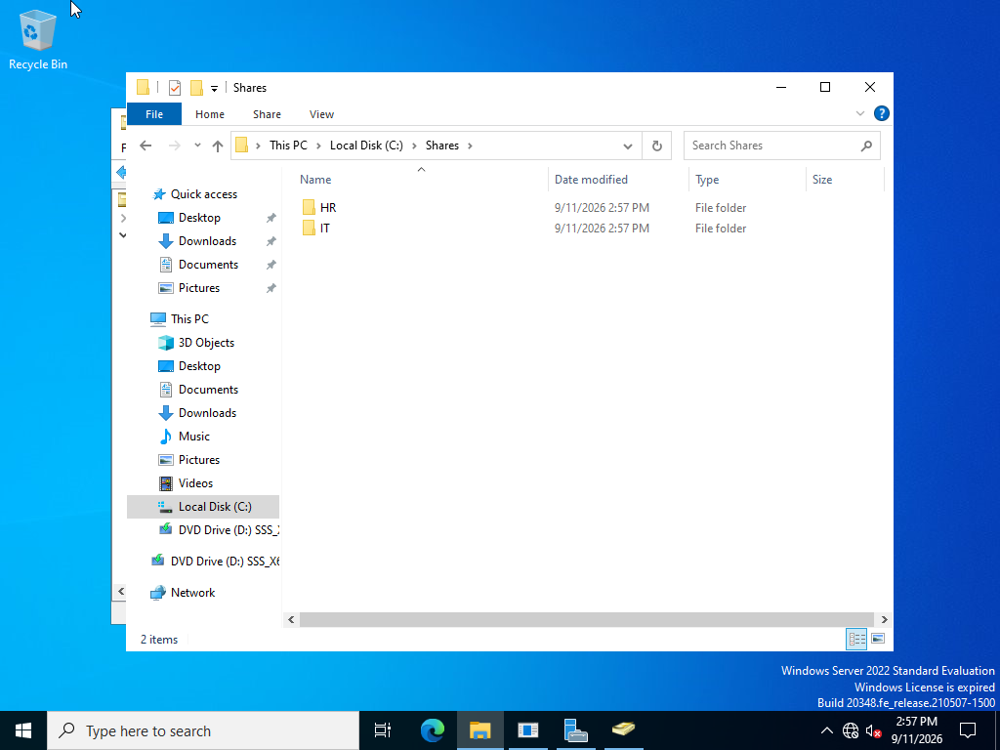
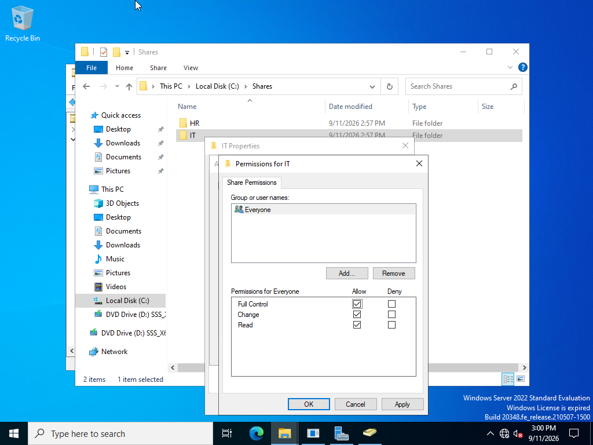
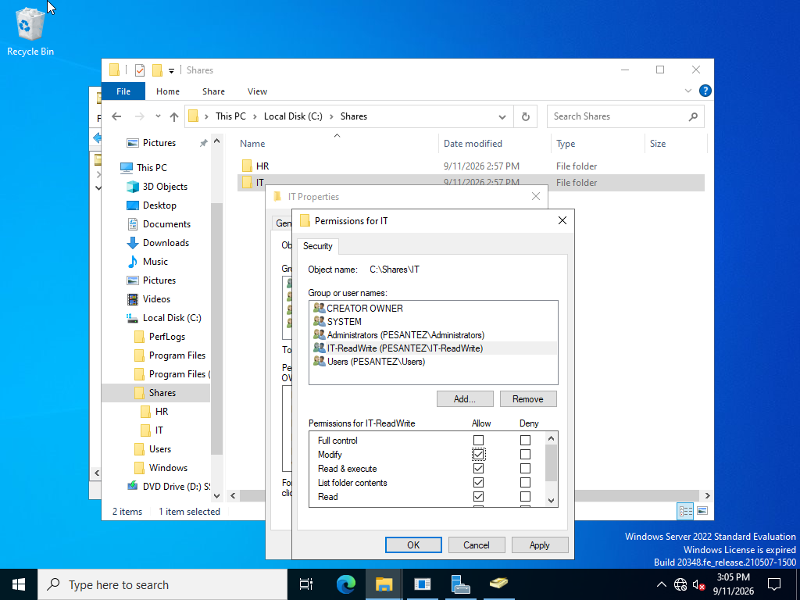
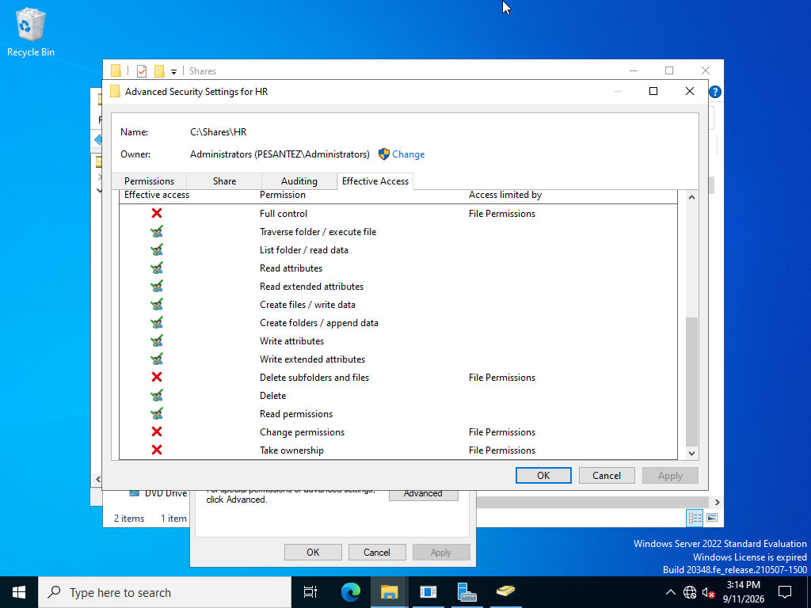
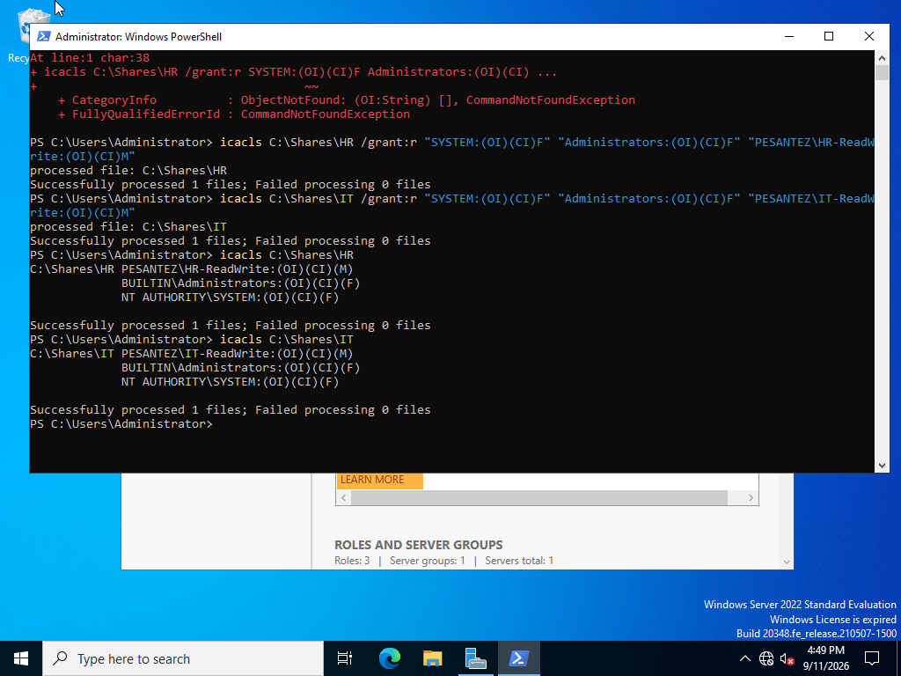
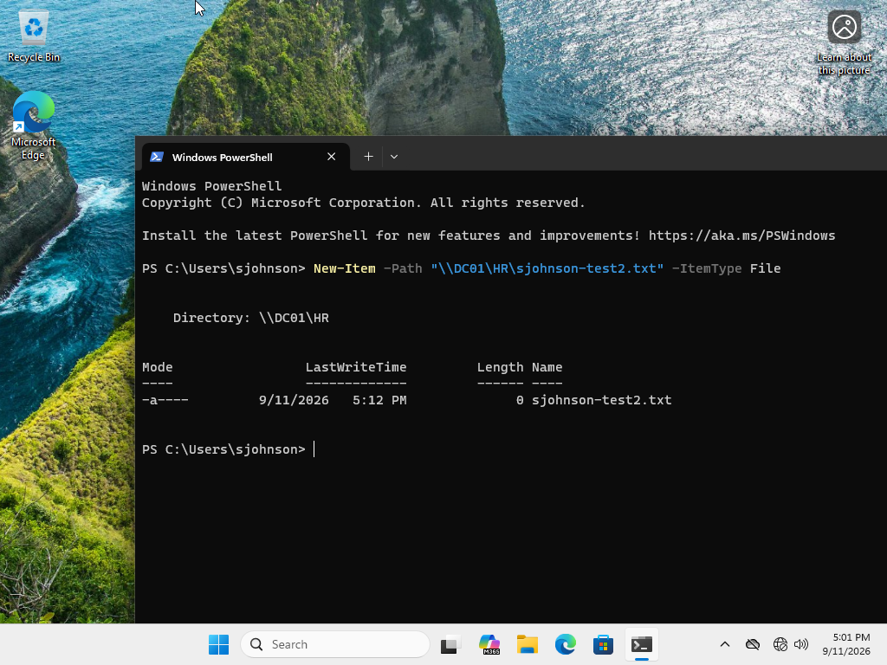
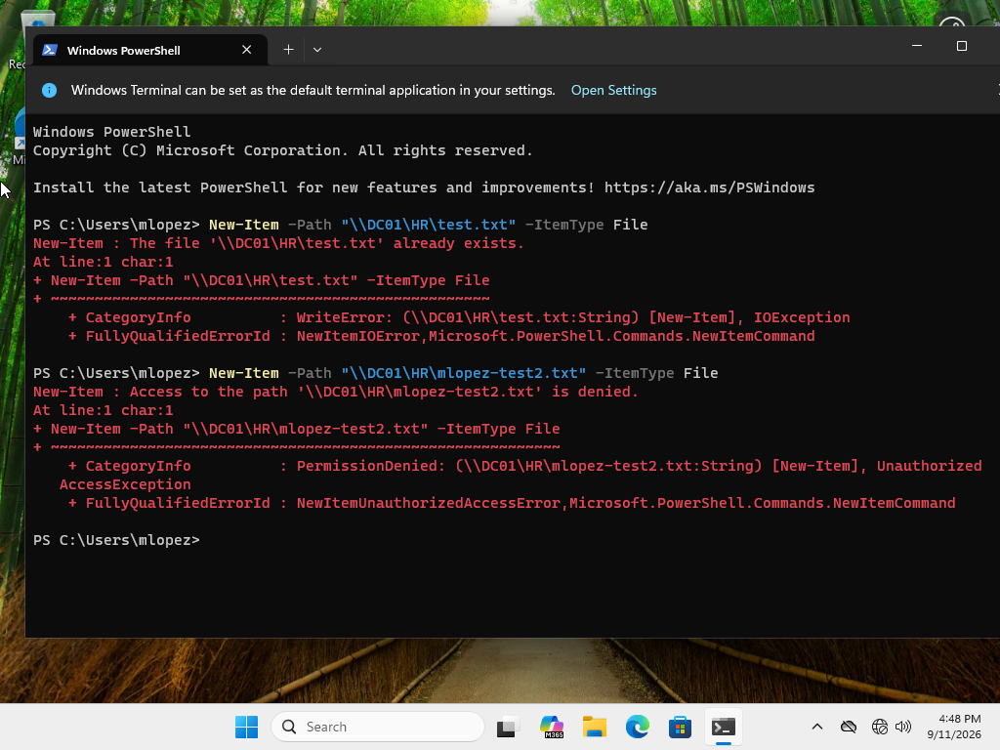

# Lab 4: IAM / RBAC / NTFS Permissions

> Moving from domain-wide policy (Lab 3) to resource-level access control — proving least privilege with security groups, NTFS permissions, and the Effective Access tool. What started as a clean textbook setup turned into a real permissions-leak investigation, fixed by rebuilding the ACLs from the command line instead of trusting the GUI.

**Status:** ✅ Complete

---

## 🎯 Objectives
- Design a least-privilege access model using role-based security groups rather than assigning permissions to individual users
- Create department shared folders and apply NTFS permissions scoped to the matching group only
- Understand the difference between Share permissions and NTFS permissions, and how effective access is calculated when both apply
- Use the Effective Access tool (Advanced Security Settings) to verify access before testing on a client
- Prove least privilege with positive and negative tests — the right user gets in, the wrong user is denied, on both sides of the RBAC model

## 🏗️ Environment
| Component | Details |
|---|---|
| Platform | VMware Workstation |
| Server | DC01 — Windows Server 2022 (192.168.92.10) |
| Client | WIN11-CLIENT — Windows 11 Pro, domain-joined (Lab 2) |
| Test users | sjohnson (Corp/Users/HR) · mlopez (Corp/Users/IT) |
| Tools | File Explorer / Advanced Sharing, Active Directory Users and Computers, Advanced Security Settings → Effective Access, `icacls`, `whoami /groups`, PowerShell `New-Item` |

## 🔧 Steps

### 1. Create role-based security groups
In ADUC, created security groups matching each department — `HR-ReadWrite` (containing sjohnson) in the HR OU, and `IT-ReadWrite` (containing mlopez) in the IT OU — rather than permissioning users individually.



### 2. Create the department share structure on DC01
Created `C:\Shares\HR` and `C:\Shares\IT` and shared each one.



### 3. Set Share permissions
Left Share permissions broad (`Everyone: Full Control`) on purpose — the real restriction was meant to happen at the NTFS layer, since effective access over the network is always the *more restrictive* of Share and NTFS.



### 4. Set NTFS permissions scoped to each security group
On each folder's Security tab, granted Modify (not Full Control) to the matching group only — `HR-ReadWrite` on `HR`, `IT-ReadWrite` on `IT`.



### 5. Verify with Effective Access — and catch a real leak
Used Advanced Security Settings → Effective Access on `C:\Shares\IT` to check sjohnson's access before ever touching the client. The tool showed her with Modify-level access (Create files/write data, Create folders/append data, etc.) despite **not** being a member of `IT-ReadWrite`.



### 6. Confirm the leak live, then find and fix the root cause
Rather than trust the GUI preview alone, confirmed it live: in a PowerShell session with `whoami` verified as `pesantez\sjohnson`, running `New-Item -Path "\\DC01\IT\test.txt"` **succeeded** — a genuine access violation, not a tool quirk. A follow-up control test with mlopez showed the same problem in reverse: she could also write to `\\DC01\HR`, which she has no business accessing either.

Investigation ruled out the obvious suspects one at a time:
- Group membership — clean (`whoami /groups` for sjohnson showed no `IT-ReadWrite`)
- The `Users` group's checkboxes in the simple Security tab — showed Read-only, no Write
- A hidden/inherited entry — the folder's full permission list (`CREATOR OWNER`, `SYSTEM`, `<Dept>-ReadWrite`, `Administrators`, `Users`) had nothing unaccounted for

Since the GUI-reported state didn't match the folder's actual enforced behavior, the fix was to stop trusting incremental GUI edits and rebuild each folder's ACL from scratch with `icacls`:

```
icacls C:\Shares\IT /reset
icacls C:\Shares\IT /inheritance:r
icacls C:\Shares\IT /grant:r "SYSTEM:(OI)(CI)F" "Administrators:(OI)(CI)F" "PESANTEZ\IT-ReadWrite:(OI)(CI)M"
```

(and the equivalent for `HR`). This strips inheritance and replaces the entire explicit permission list with exactly three clean entries — no ambiguity, no leftover state.



### 7. Re-test as sjohnson — HR allowed, IT denied
With clean ACLs in place, sjohnson was tested again from WIN11-CLIENT:

```
New-Item -Path "\\DC01\HR\sjohnson-test2.txt" -ItemType File   # Succeeded — expected
New-Item -Path "\\DC01\IT\sjohnson-test3.txt" -ItemType File   # Access denied — expected
```



### 8. Control test as mlopez — IT allowed, HR denied
Same pair of tests run as mlopez, confirming RBAC now works correctly in both directions:

```
New-Item -Path "\\DC01\IT\mlopez-test.txt" -ItemType File      # Succeeded — expected
New-Item -Path "\\DC01\HR\mlopez-test2.txt" -ItemType File     # Access denied — expected
```



## ✅ Verification
- `HR-ReadWrite` and `IT-ReadWrite` groups exist in AD with the correct, and only the correct, members
- `icacls` output on both folders shows exactly three entries each: `SYSTEM (F)`, `Administrators (F)`, and the matching `-ReadWrite` group (M) — no `Users`, no leftover entries
- sjohnson: allowed on `\\DC01\HR`, denied on `\\DC01\IT`
- mlopez: allowed on `\\DC01\IT`, denied on `\\DC01\HR`
- Tests were run as live, same-session PowerShell commands (`whoami` immediately followed by `New-Item`) rather than relying on the Effective Access preview alone

## 🧠 What broke / What I learned
- **Problem:** After what looked like a correct group-scoped NTFS configuration (Modify granted to the right group, `Users` left Read-only), both test users could still write to *both* department folders — including the one they weren't supposed to have any access to.
- **Diagnosis:** The GUI's simple Security tab was showing a permission state (`Users`: Read-only, no Write) that didn't match what was actually being enforced on the folder. Checked group membership and the visible ACL entries — both looked clean, yet the live write tests kept succeeding for both users on both folders. That mismatch — GUI state vs. real-world behavior — was the actual finding, more than any single misconfigured checkbox.
- **Fix:** Stopped trying to diagnose the GUI and instead rebuilt each folder's permissions from zero using `icacls /reset`, `/inheritance:r`, and `/grant:r` — a fully explicit, from-scratch ACL with exactly the three principals that should be there. This resolved it immediately and verifiably.
- **Takeaway:** In a real environment, "the checkboxes look right" isn't verification — a live access test is. This is also a good argument for preferring scriptable, auditable tools like `icacls` over incremental point-and-click permission edits when something needs to be provably correct, especially for access control where a silent over-grant is a real security issue, not just a lab inconvenience.

## 🔗 Skills demonstrated
Role-based access control (RBAC) · NTFS permissions · Share vs. NTFS effective access · Least privilege design · Effective Access tool · Access verification (`icacls`, `whoami /groups`, live PowerShell testing) · Permission troubleshooting and remediation via command-line ACL rebuild

---
*Part of the [IT-Labs portfolio](../../README.md) · Jose Pesantez*
